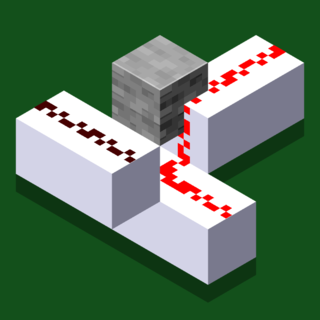
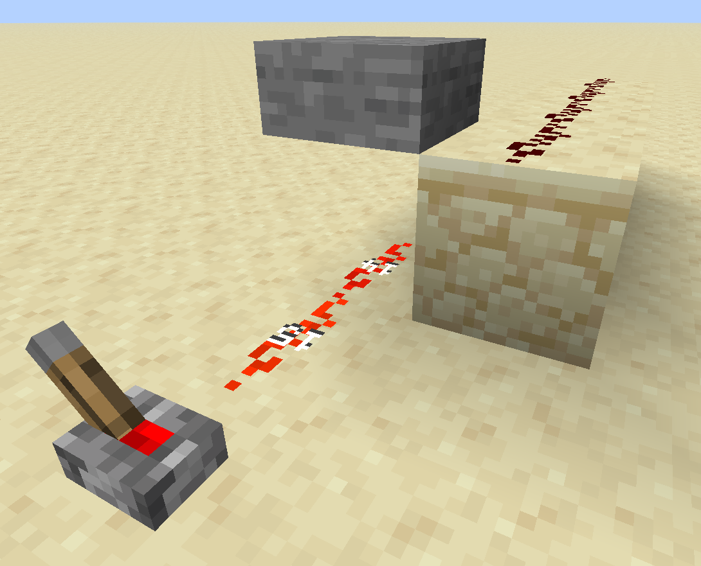
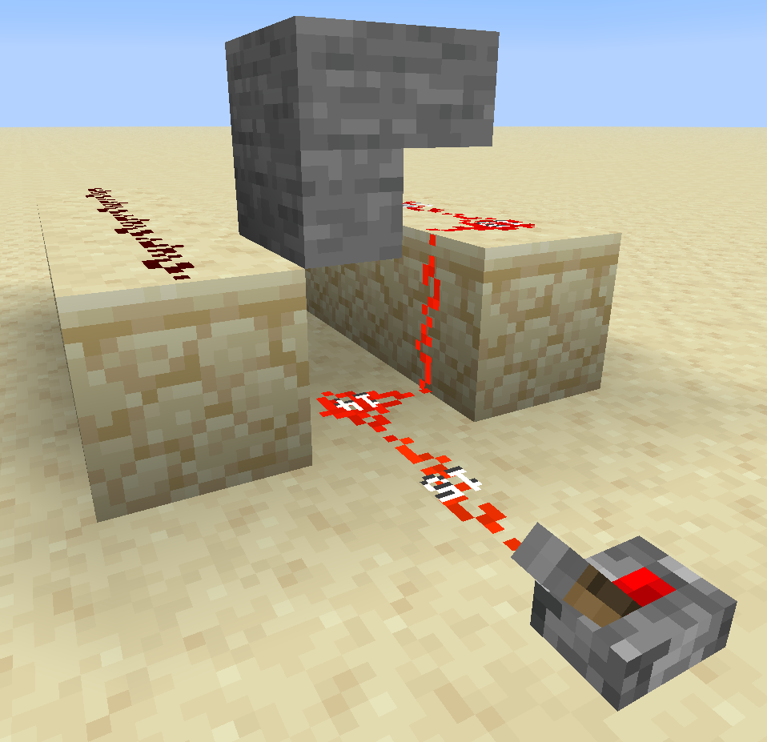
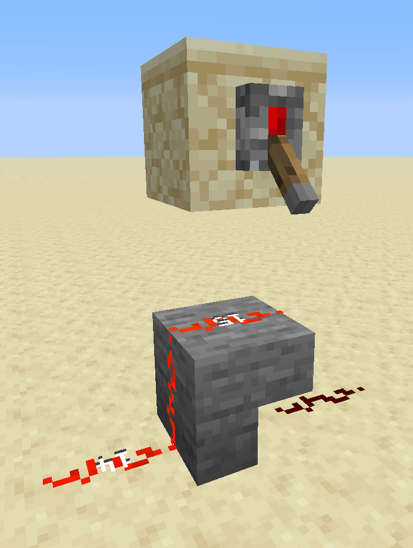
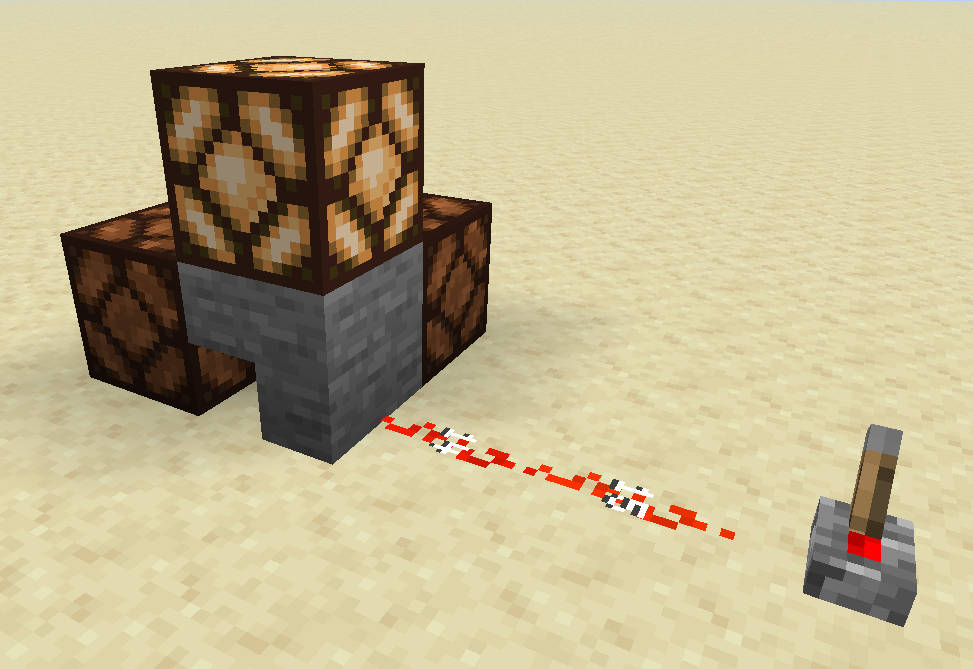

<h2 align="center">
Stairstone  

</h2>

### Allows stairs and slabs to control the directions in which Redstone connects and powers

> [!IMPORTANT]
>
> This mod will not work with [Lithium](https://modrinth.com/mod/lithium) unless `mixin.block.redstone_wire=false` is set in its config.
>
> This mod may not work with [Carpet](https://modrinth.com/mod/carpet), any Carpet addons, or any other mod that mixins to Redstone behaviour.

## Directional upwards Redstone blocking
Slabs and stairs will now block Redstone going up if the bottom or side face in that direction is fully covered

Screenshots:

Blocking with a slab

Blocking with stairs

## Directional downwards Redstone
Redstone can now travel down stairs on the sides which have full faces

Screenshot

## Directional powering
A Redstone signal running into a stair block will only power the sides that have a full face

> [!NOTE]
>
> Changing the shape of a stair block using a neighbouring stair block does NOT send an update to the powered blocks, or the blocks to be powered. This is a limitation of the mod, but it also adds another way to have blocks in a BUD'ed state, i.e. they are unpowered/powered when they receive the next neighbour update.

Powering a lamp

Powering a Redstone line

## Block tag
Mods and data packs can change which blocks affect Redstone using the following block tags, or clear the tag to disable it entirely:
- `stairstone:directional_redstone_connects` (directional blocking and downwards)
- `stairstone:directional_redstone_power` (directional powering)
